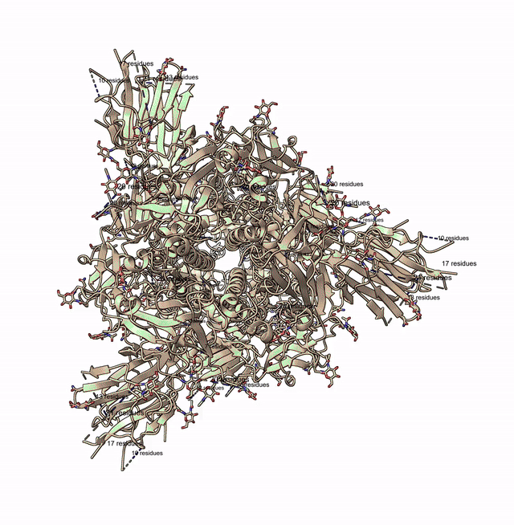
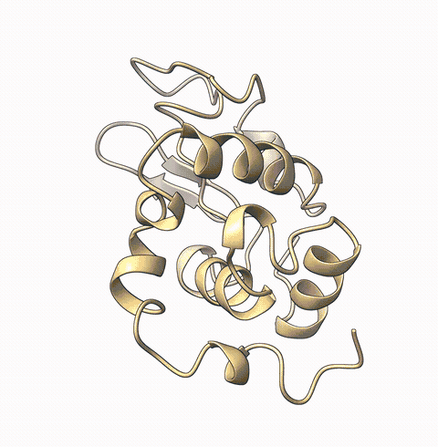

# ChimeraX MCP Server

[](https://pypi.org/project/chimerax-mcp/)
[](LICENSE)
[](https://www.python.org/downloads/)

**Talk to proteins in natural language.** This MCP server connects AI coding tools (Claude Code, Cursor, VS Code, etc.) to [UCSF ChimeraX](https://www.cgl.ucsf.edu/chimerax/), letting you load, edit, visualize, and analyze protein structures through conversation -- no manual ChimeraX commands needed.

Just say *"open 6VXX, mutate A:501 to Lys, color by hydrophobicity, and take a screenshot"* and watch ChimeraX do it in real time.

> This project is in early development and actively looking for contributors. Bug reports, feature requests, and pull requests are very welcome -- check out the [issues page](https://github.com/mahynotch/chimerax-mcp/issues) or open a PR!

## Demos

**Load & Visualize**
> *"Load 3LJ5, show only chain A, make it publication-ready with rainbow coloring and transparent surface"*


**Mutate Residue**
> *"Open 6VXX, zoom to residue A:501, highlight it, mutate Thr to Lys, show nearby residues"*



**Electrostatic & Hydrophobicity Surfaces**
> *"Load 1AKI, show surface, color by electrostatic potential, then switch to hydrophobicity"*



## Features

- **39 tools** covering structure loading, editing, visualization, measurement, selection, and video recording
- **Auto-launches ChimeraX** -- no manual setup needed, just install and go
- **Works with any MCP client** -- Claude Code, Cursor, Windsurf, VS Code Copilot, Cline, OpenCode, Continue, Claude Desktop
- **Built-in agent instructions** -- AI agents automatically learn ChimeraX spec syntax and common workflows
- **Security hardened** -- command injection prevention, dangerous command blocking, script path validation
- **Accepts flexible input** -- both `A:48` and `/A:48` spec formats, both 1-letter and 3-letter amino acid codes
- **Video recording** -- capture sessions as MP4, record turntable spins
- **Run custom scripts** -- execute `.cxc` and `.py` scripts with path validation

## Prerequisites

- **UCSF ChimeraX** installed ([download](https://www.cgl.ucsf.edu/chimerax/download.html))
- **Python 3.10+**

ChimeraX will be **launched automatically** when the first tool is called. No need to start it manually or enable the REST API yourself.

<details>
<summary>Manual setup (if auto-launch doesn't work)</summary>

Open ChimeraX and run in its command line:

```
remotecontrol rest start port 8765
```

To use a custom ChimeraX install location, set the `CHIMERAX_BIN` environment variable:

```bash
export CHIMERAX_BIN="/path/to/ChimeraX"
```
</details>

## Installation

```bash
pip install chimerax-mcp
```

<details>
<summary>Other install methods</summary>

From GitHub (latest dev):

```bash
pip install git+https://github.com/mahynotch/chimerax-mcp.git
```

From source (development):

```bash
git clone https://github.com/mahynotch/chimerax-mcp.git
cd chimerax-mcp
pip install -e .
```
</details>

## MCP Configuration

After installing, add the server to your AI coding tool:

<details open>
<summary><strong>Claude Code</strong></summary>

```bash
claude mcp add -s user chimerax -- chimerax-mcp
```
</details>

<details>
<summary><strong>Claude Desktop</strong></summary>

Edit config file:
- macOS: `~/Library/Application Support/Claude/claude_desktop_config.json`
- Windows: `%APPDATA%\Claude\claude_desktop_config.json`
- Linux: `~/.config/Claude/claude_desktop_config.json`

```json
{
  "mcpServers": {
    "chimerax": {
      "command": "chimerax-mcp",
      "args": []
    }
  }
}
```
</details>

<details>
<summary><strong>Cursor</strong></summary>

Add to `~/.cursor/mcp.json` (global) or `.cursor/mcp.json` (project):

```json
{
  "mcpServers": {
    "chimerax": {
      "command": "chimerax-mcp",
      "args": []
    }
  }
}
```
</details>

<details>
<summary><strong>Windsurf</strong></summary>

Add to `~/.codeium/windsurf/mcp_config.json`:

```json
{
  "mcpServers": {
    "chimerax": {
      "command": "chimerax-mcp",
      "args": []
    }
  }
}
```
</details>

<details>
<summary><strong>VS Code (Copilot)</strong></summary>

Add to `.vscode/mcp.json`:

```json
{
  "servers": {
    "chimerax": {
      "type": "stdio",
      "command": "chimerax-mcp"
    }
  }
}
```
</details>

<details>
<summary><strong>Cline</strong></summary>

Use the "Edit MCP Settings" button in the Cline panel, or edit directly:
- macOS: `~/Library/Application Support/Code/User/globalStorage/saoudrizwan.claude-dev/settings/cline_mcp_settings.json`
- Windows: `%APPDATA%\Code\User\globalStorage\saoudrizwan.claude-dev\settings\cline_mcp_settings.json`

```json
{
  "mcpServers": {
    "chimerax": {
      "command": "chimerax-mcp",
      "args": [],
      "disabled": false
    }
  }
}
```
</details>

<details>
<summary><strong>OpenCode</strong></summary>

Add to `~/.config/opencode/opencode.json` or project `opencode.json`:

```json
{
  "mcp": {
    "chimerax": {
      "type": "local",
      "command": ["chimerax-mcp"],
      "enabled": true
    }
  }
}
```
</details>

<details>
<summary><strong>Continue</strong></summary>

Add to `.continue/config.yaml`:

```yaml
mcpServers:
  - name: chimerax
    type: stdio
    command: chimerax-mcp
```
</details>

## Quick Start

Once configured, just talk naturally:

> "Open 6VXX, color by chain, show surface, zoom to residue A:501"

The AI will call MCP tools sequentially and ChimeraX renders each step in real time:

1. `open_structure("6VXX")` -- fetches the structure from RCSB
2. `color_structure("#1", "chain")` -- colors each chain differently
3. `show_surface("#1")` -- displays the molecular surface
4. `zoom_to("/A:501")` -- centers the view on residue 501 of chain A

## Available Tools (39)

### Structure (6)
| Tool | Description |
|------|-------------|
| `open_structure` | Open PDB ID, file path, or URL |
| `close_structure` | Close one or all models |
| `save_structure` | Save to PDB/mmCIF/mol2 |
| `list_models` | List all open models |
| `get_sequence` | Get amino acid sequence for a chain |
| `run_script` | Execute a `.cxc` or `.py` script |

### Editing (4)
| Tool | Description |
|------|-------------|
| `mutate_residue` | Swap residue using Dunbrack rotamer library |
| `delete_atoms` | Delete atoms or residues |
| `add_hydrogen` | Add hydrogens (protonate) |
| `minimize_energy` | Run energy minimization |

### Visualization (18)
| Tool | Description |
|------|-------------|
| `color_structure` | Color by scheme (`chain`, `bfactor`, `rainbow`) or named/hex color |
| `show_electrostatic_surface` | Coulombic ESP (red=negative, blue=positive) |
| `show_hydrophobicity_surface` | Molecular Lipophilicity Potential |
| `show_surface` | Show molecular surface with optional transparency |
| `hide_surface` | Hide molecular surface |
| `show_cartoon` | Show ribbon/cartoon |
| `show_sticks` | Show stick representation |
| `hide_atoms` | Hide atoms |
| `zoom_to` | Zoom camera to a selection |
| `set_background` | Set background color |
| `label_residues` | Add text labels to residues |
| `clear_labels` | Remove all labels |
| `reset_view` | Reset to default camera view |
| `take_snapshot` | Save PNG screenshot |
| `start_recording` | Begin recording session as video |
| `stop_recording` | Stop recording and save to MP4/WebM/MOV |
| `spin` | Rotate model around an axis |
| `record_spin` | Record a full turntable spin video |

### Measurement (6)
| Tool | Description |
|------|-------------|
| `measure_distance` | Distance between two atoms (Angstroms) |
| `measure_angle` | Bond angle from three atoms (degrees) |
| `align_and_rmsd` | Structural alignment with RMSD |
| `find_contacts` | Residues within N Angstroms of selection |
| `get_bfactors` | B-factor values for selection |
| `measure_buried_area` | Buried solvent-accessible surface area |

### Selection (5)
| Tool | Description |
|------|-------------|
| `select_atoms` | Select by ChimeraX specifier |
| `select_near` | Select within distance |
| `select_chain` | Select entire chain |
| `invert_selection` | Invert current selection |
| `name_selection` | Save selection under a reusable name |

## Security

Commands are sanitized before being sent to ChimeraX:

- **Command injection blocked** -- `;` and newlines rejected (ChimeraX uses these as command separators)
- **Dangerous commands blocked** -- `exec`, `shell`, `system` are rejected
- **Script execution validated** -- `run_script` only accepts existing `.cxc`/`.py` files with path validation
- **Local-only** -- REST API listens on `127.0.0.1` only, not exposed to the network

## Testing

Run the full test suite (53 tests) against a live ChimeraX instance:

```bash
pip install pytest
python -m pytest tests/test_live.py -v
```

Security tests run without ChimeraX. Live tests auto-skip if ChimeraX is not available.

## For AI Agents: Auto-Install

If a user asks you to install this MCP server, follow these steps:

1. Install the package:
```bash
pip install chimerax-mcp
```

2. Register the MCP server (detect the user's tool and run the appropriate command):

| Tool | Command |
|------|---------|
| Claude Code | `claude mcp add -s user chimerax -- chimerax-mcp` |
| Cursor | Add to `~/.cursor/mcp.json` |
| VS Code | Add to `.vscode/mcp.json` |

For Cursor / VS Code / others, create or update the config file with:
```json
{
  "mcpServers": {
    "chimerax": {
      "command": "chimerax-mcp"
    }
  }
}
```

3. Restart the AI tool to load the new MCP server.
4. Verify with a test call: `open_structure("1aki")`

**Important:** Before proceeding, confirm with the user that UCSF ChimeraX is installed on their machine. If not, direct them to https://www.cgl.ucsf.edu/chimerax/download.html -- the server auto-launches ChimeraX but cannot install it.

## Disclaimer

This project is not affiliated with, endorsed by, or sponsored by UCSF or the RBVI team. "ChimeraX" is a trademark of the University of California. This server communicates with ChimeraX through its public REST API and contains no ChimeraX source code.

Users are responsible for complying with [ChimeraX's license terms](https://www.cgl.ucsf.edu/chimerax/license.html). ChimeraX is free for academic and non-commercial use; commercial use requires a separate license from UCSF.

## License

MIT -- see [LICENSE](LICENSE)
